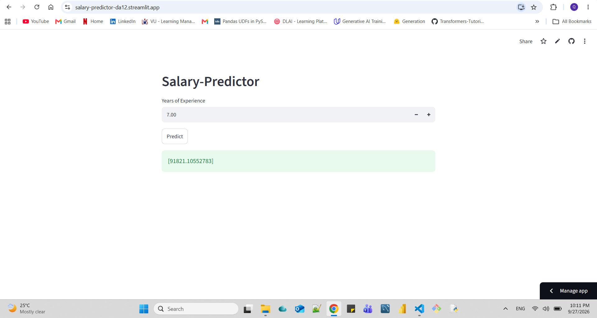

# Salary-Predictor

A machine learning web application that predicts an employee's salary based on their years of experience, built as an end-to-end ML project — from data exploration to a deployed, interactive web app.

**Live App:** [salary-predictor-da12.streamlit.app](https://salary-predictor-da12.streamlit.app/)



## Overview

This project uses a Linear Regression model to predict salary based on years of professional experience. It covers the complete ML workflow: data loading and preprocessing, model training and evaluation, model serialization, and deployment as an interactive Streamlit web app.

## Dataset

The dataset (`Salary Data.csv`) contains two columns:
- **Experience Years** – years of professional experience
- **Salary** – corresponding salary

## Tech Stack

- Python
- pandas, numpy
- scikit-learn
- Streamlit
- Matplotlib / Seaborn

## Model

**Algorithm:** Linear Regression

**Evaluation Metrics:**

| Metric   | Value       |
|--------  |------------ |
| R² Score | 0.9822      |
| MSE      | 23745684.25 |
| MAE      | 4056.34     |
| RMSE     | 4872.95     |

The model explains ~98% of the variance in salary based on years of experience, indicating a strong fit.

## Project Structure
Salary-Predictor/
│
├── model.ipynb # Data exploration, preprocessing, model training & evaluation

├── model.pkl # Serialized trained model

├── app.py # Streamlit web application

├── requirements.txt # Project dependencies

├── README.md

└── .gitignore


## How to Run Locally

1. **Clone the repository**
```bash
git clone https://github.com/QursamFarooq/Salary-Predictor.git
cd Salary-Predictor
```

2. **Create and activate a virtual environment**
```bash
python -m venv env_name
env_name\Scripts\activate      # Windows
```

3. **Install dependencies**
```bash
pip install -r requirements.txt
```

4. **Run the app**
```bash
streamlit run app.py
```

The app will open in your browser at `http://localhost:8501`.

## Author

Qursam Farooq